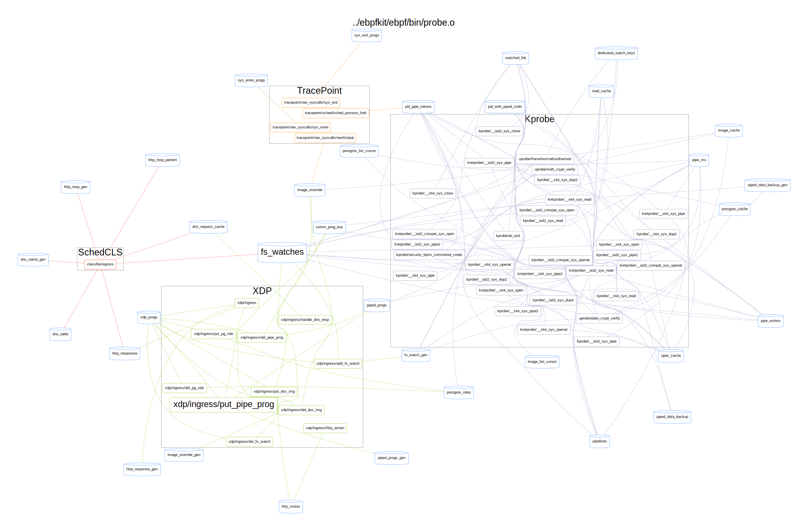

# ebpfkit-monitor

[](https://www.gnu.org/licenses/old-licenses/gpl-2.0.en.html)
[](https://opensource.org/licenses/Apache-2.0)

`ebpfkit-monitor` is an utility that you can use to statically analyse eBPF bytecode or monitor suspicious eBPF activity at runtime. It was specifically designed to detect [`ebpfkit`](https://github.com/Gui774ume/ebpfkit).

## **Disclaimer**
This project is **not** an official Datadog product (experimental or otherwise), it is just code that happens to be developed by Datadog employees as part of an independent security research project. The rootkit herein is provided for educational purposes only and for those who are willing and curious to learn about ethical hacking, security and penetration testing with eBPF.

**Do not attempt to use these tools to violate the law. The author is not responsible for any illegal action. Misuse of the provided information can result in criminal charges.**

## System requirements

- golang 1.13+
- This project was developed on a Ubuntu Focal machine (Linux Kernel 5.4)
- Kernel headers are expected to be installed in `lib/modules/$(uname -r)` (see `Makefile`)
- clang & llvm (11.0.1)
- Graphviz (to generate graphs)
- go-bindata (`go get -u github.com/shuLhan/go-bindata/...`)

## Build

1) To build `ebpfkit-monitor`, run:

```shell script
# ~ make
```

2) To install `ebpfkit-monitor` (copies `ebpfkit-monitor` to `/usr/bin/ebpfkit-monitor`) run:
```shell script
# ~ make install
```

## Getting started

Run `ebpfkit-monitor -h` to get help.

```shell script
# ~ ebpfkit-monitor -h
Usage:
  ebpfkit-monitor [command]

Available Commands:
  graph       graph generates a graphviz representation of the ELF file
  help        Help about any command
  map         prints information about one or multiple maps
  prog        prints information about one or multiple programs
  report      prints summarized information about the maps and programs
  start       start monitoring the bpf syscall at runtime

Flags:
  -h, --help               help for ebpfkit-monitor
  -l, --log-level string   log level (options: panic, fatal, error, warn, info, debug or trace). Set to "debug" to see bpf events. (default "info")

Use "ebpfkit-monitor [command] --help" for more information about a command.
```

## Examples

#### List all the program sections provided in the ELF file

```shell
# ~ ebpfkit-monitor prog --asset my_elf_file.o
```

#### Dump the bytecode of a program

```shell
# ~ ebpfkit-monitor prog --asset my_elf_file.o --section kprobe/my_program --dump
```

#### List all the programs that use the bpf_probe_write_user eBPF helper

```shell
# ~ ebpfkit-monitor prog --asset my_elf_file.o --helper BpfProbeWriteUser
```

#### List all the programs that interact with the "piped_progs" eBPF map

```shell
# ~ ebpfkit-monitor prog --asset my_elf_file.o --map piped_progs
```

#### List all the maps declared in the ELF file

```shell
# ~ ebpfkit-monitor map --asset my_elf_file.o
```

#### Monitor the bpf syscall and print events to the screen

```shell
# ~ sudo ebpfkit-monitor start --log-level debug
```

#### Monitor the bpf syscall and write the captured events in a file

```shell
# ~ sudo ebpfkit-monitor start --output /tmp
```

#### Monitor the bpf syscall, write the captured events in a file and ensure that only "bpftool" is allowed to use the "bpf" syscall

```shell
# ~ sudo ebpfkit-monitor start --output /tmp --allowed-processes "/usr/sbin/bpftool"
```

#### Generate a graph from the provided ELF file

```shell script
# ~ ebpfkit-monitor graph -a my_elf_file.o
INFO[2021-08-03T13:19:12Z] Graph generated: /tmp/ebpfkit-monitor-graph-4104912074
# ~ fdp -Tsvg /tmp/ebpfkit-monitor-graph-4104912074 > ./graphs/output.svg
```



## Future work

- Move the project to BTF & CO-RE
- Use `lsm` eBPF programs instead of `bpf_override_return` for access control

## License

- The golang code is under Apache 2.0 License.
- The eBPF programs are under the GPL v2 License.